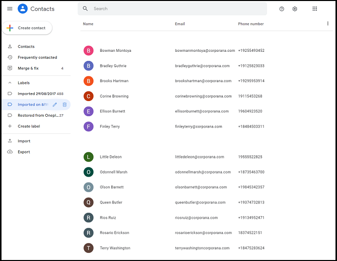
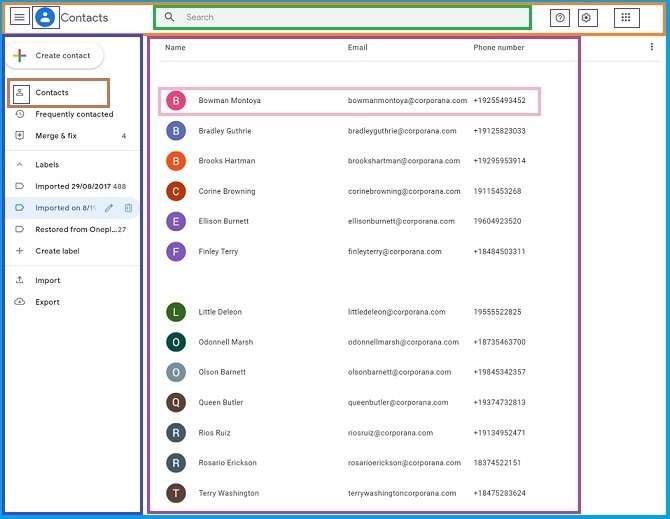
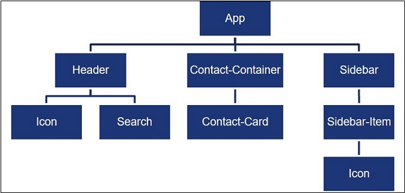
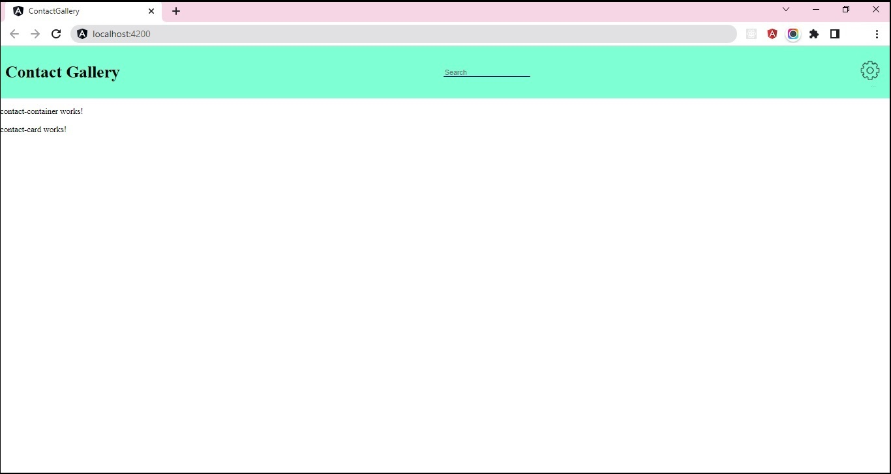
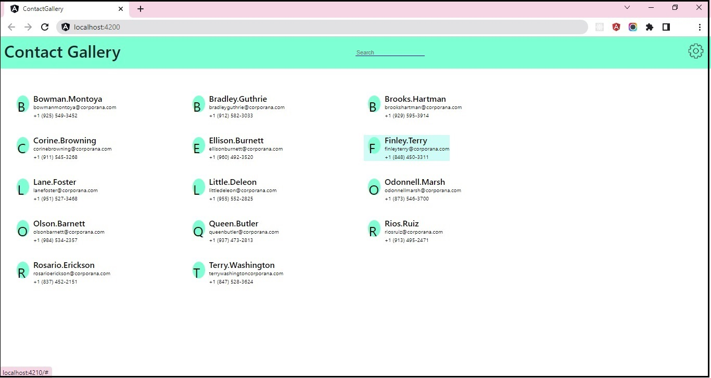

## Practice

This practice comprises 3 exercises.

### Problem Statements

#### Practice 1 - Create Components for Contact-Gallery App

Managing Contacts is one of the popular and widely used services provided by Google.

Google Contacts is an SPA, that provides this service to its registered users.

Given here is the screenshot of contact list view of Google Contacts app.

The image below show the components identified for the contact list view.

For the components identified, component hierarchy is build, that depicts parent-child relationship between these components

The diagram below shows the component hierarchy with the components identified

Create Angular app named `contact-gallery` using the Angular CLI command:

    `ng new --skip-tests contact-gallery`

Create components as shown in the component hierarchy diagram above.

**Note**: For the practice exercises of this sprint, the `sidebar` branch can be ignored.

Use Angular CLI command `ng generate component <component-name>` or `ng g c <component-name>` to create components.​

Render the components using component selector as per the hierarchy. 

For example,  

`App` component should render `Header` and `Contact-Container` components.​

`Header` component should render `Icon` and `Search` components.

`Contact-Container` component should render `Contact-Card` component.​

Design `Header` component that displays app title, search box and a settings icon.

Below is the snapshot of the output expected:

#### Practice 2 - Create Contact View to Display Contacts

Modify the `Contact-Gallery` app code to design view that displays the contacts stored in `contacts.ts` file.

Create folder with name `models` under the `app` folder of the `Contact-Gallery` code.

Copy the `contacts.ts` and `contact.ts` file from the `resources` folder provided with the boilerplate code.

The `CONTACTS` array, defined in `contacts.ts` file under `models` folder, stores object of type `Contact`. The type `Contact` is defined in `contact.ts` file under `models` folder.

The Contact view should be rendered by `Contact-Container` component that reads the contacts from `CONTACTS` array and assigns it to the `contacts` property of the component class.

On the template of `Contact-Container` component, iterate through the `contacts` property using `*ngFor` directive.

On each iteration, for the `contact` object traversed, the `Contact-Container` component should render `Contact-Card` component providing `contact` object as the input for presentation using property binding.

The `Contact-Card` component should receive the input in `contact` property and present the contact details.

Style the components to present the contact details in a grid layout with each contact data presented in tiled format.

Below is the snapshot of the output expected:

#### Practice 3 - Display Details of Contact Hovered

Enhance the `Contact-Gallery` app to display the details of contact when the user hovers on a particular contact.

Add a component `Contact-Card-Details` which will be rendered by the `Contact-Container` component with contact details when its child - the `Contact-Card` component is hovered.

For the `Contact-Container-Component` to be notified about the contact hovered, each instance of the `Contact-Card` component should emit `contactHovered` event.

**Note:** The child component notifies the parent component and shares data by emitting event.

The event should be emitted when the contact card is hovered with `contact` data and the same event should be emitted with null value when the mouse moves out of the contact card.

The `Contact-Container` component should listen to the emitted event and associate event with event handler method `onContactHovered()`. The handler method should accept contact data passed by child component using `$event` argument.

The handler method should check whether the $event argument contains contact data or null value and accordingly update the contact card details.

**Note:** When the mouse leaves the contact card, the `Contact-Card-Details` component should not render any data and clean up previously rendered data.

Below is the snapshot of the output expected:

